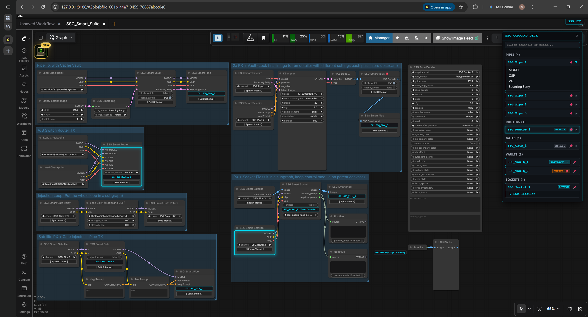
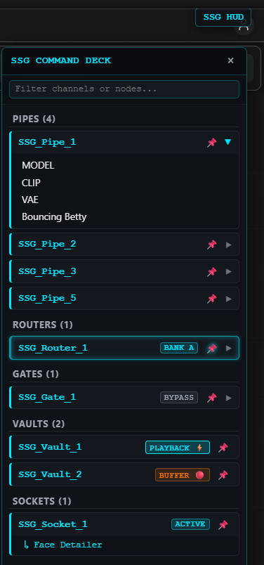
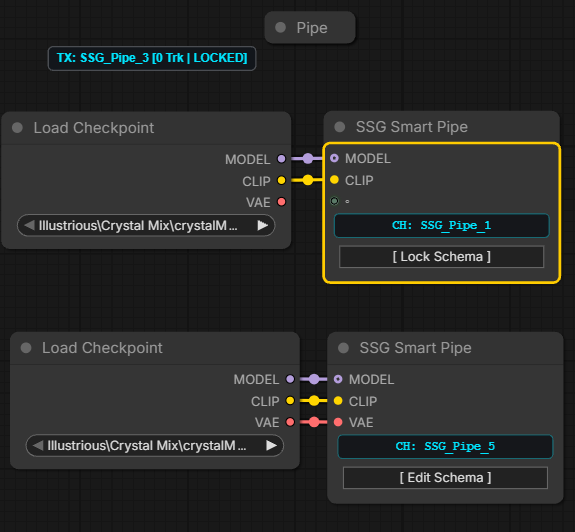
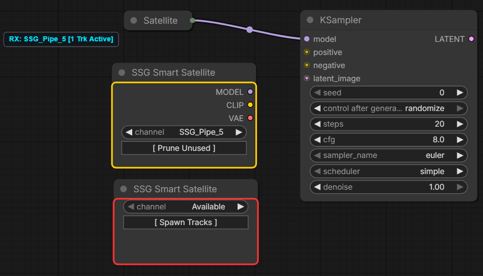
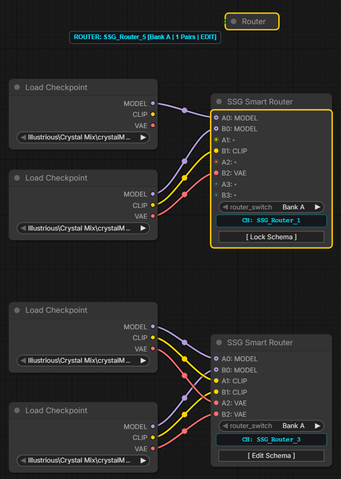
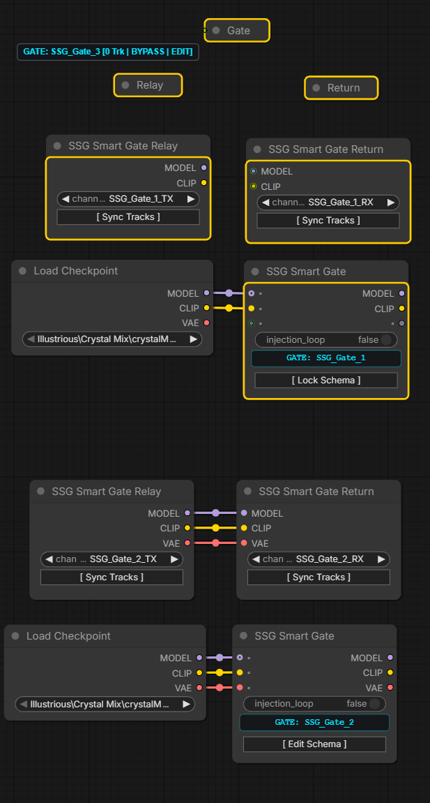
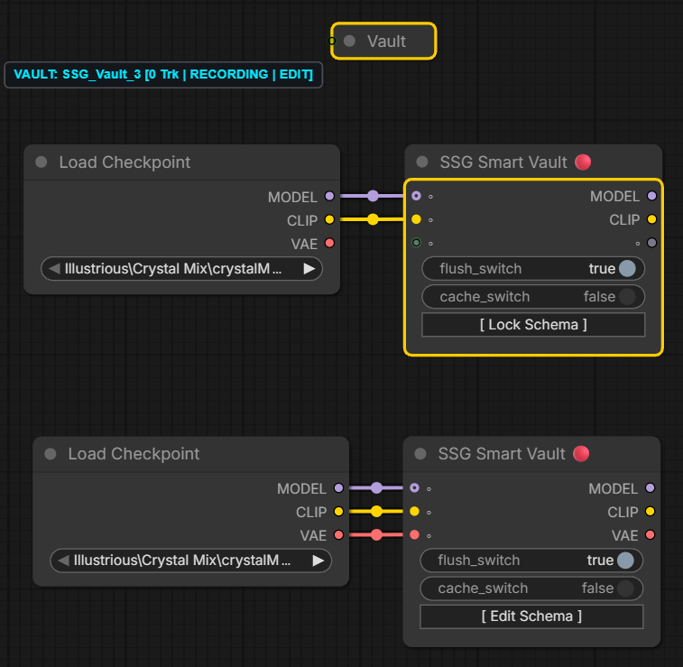
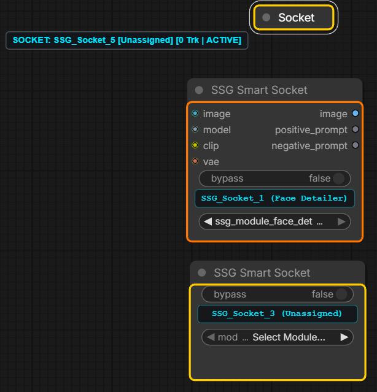
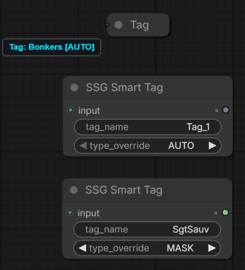

# SSG Smart Suite V3.0 for ComfyUI

> *"We build tools that fix the engine; we do not repaint the chassis."*[cite: 2, 5]

**SSG Smart Suite** is a native, high-performance signal-routing, workflow-organization, and virtual-memory architecture for ComfyUI[cite: 5]. It eliminates noodle sprawl across complex workflows and nested subgraphs without breaking execution performance, monkey-patching DOM elements, or adding overhead[cite: 4, 5].

---

## 📸 Overview & Command Deck

### What Makes SSG Smart Suite Different?
* **Native ComfyUI Aesthetic:** Pure LiteGraph engineering[cite: 5]. Standard node bounds (`220px`), native typography, clean slot behaviors, and zero DOM pop-up conflicts[cite: 2, 5].
* **Seamless Subgraph Compatibility:** Route multi-lane buses directly into and out of nested subgraphs with zero connection breaks[cite: 3, 5].
* **Zero-Latency graphToPrompt Flattening:** Wireless connections execute as physical native wires in the PyTorch execution backend[cite: 5].
* **SSG Smart HUD (`Alt + S`):** A floating mission-control directory for monitoring live channels, switching states, focusing nodes, and triggering canvas-wide glow beacons[cite: 5].
* **Dynamic Smart Socket:** Universal hardware transceiver that morphs its input/output pins dynamically to host zero-wire companion appliances (like Face Detailers, LoRA Decks, and Processors)[cite: 4, 5].

---

## ⚡ Installation

### Option 1: ComfyUI-Manager (Recommended)
1. Open **ComfyUI-Manager** inside ComfyUI.
2. Search for `SSG Smart Suite`[cite: 1].
3. Click **Install** and restart ComfyUI.

### Option 2: Git Clone
Navigate to your ComfyUI custom nodes directory and run:

cd custom_nodes
git clone https://github.com/SgtSauv/ComfyUI-SSG-Smart-Suite.git

Restart ComfyUI.

---

## 🎮 SSG Smart HUD (Command Deck)

Press **`Alt + S`** (or click the floating **SSG HUD** button) anywhere on canvas to open the Command Deck[cite: 5]:

* 🔍 **Real-Time Filter:** Instant search across all active channels, tracks, and paired module names[cite: 5].
* ⚡ **Live State Toggles:** Switch Router banks (`Bank A` / `Bank B`), toggle Gate injection loops (`INJECT` / `BYPASS`), cycle Vault memory states (`PLAYBACK` / `BUFFER` / `FROZEN`), or bypass Sockets straight from the HUD[cite: 5].
* 📌 **Canvas Glow Beacon:** Click the push-pin on any row to fire an Alienware Blue high-intensity outline across all transmitters, receivers, and paired companion modules associated with that channel[cite: 2, 3, 5].
* 🎯 **Double-Click Auto-Focus:** Double-click any channel row to instantly center your canvas on that node, even if it is tucked deep inside a nested subgraph[cite: 2, 5].
* 🖱 **Alienware Context Menu:** Right-click any row for direct sub-targeting (`Focus Gate`, `Focus Relay`, `Focus Return`), highlight toggles, or remote schema locking/unlocking[cite: 5].

---

## 🧩 The Core Node Roster

### 1. SSG Smart Pipe (Master Broadcaster)

* **Role:** Bundles up to 24 arbitrary signal lanes (MODEL, CLIP, VAE, LATENT, Prompts, etc.) into a clean, collision-free wireless channel[cite: 5].
* **How it works:** Spawns with wildcard parking dots (`"◦"`)[cite: 5]. Attach your upstream wires, and the engine automatically sniffs data types and names[cite: 2, 5]. Click `[ Lock Schema ]` to serialize the manifest and broadcast it across the graph[cite: 5].

### 2. SSG Smart Satellite (Multi-Track Bus Consumer)

* **Role:** A lightweight consumer bus that receives multi-track signals anywhere in your workflow or inside subgraphs[cite: 5].
* **How it works:** Pick your channel from the dropdown and click `[ Spawn Tracks ]`[cite: 5]. Connect the outputs you need downstream, then click `[ Prune Unused ]` to collapse unlinked slots into a compact footprint[cite: 5].

### 3. SSG Smart Router (A/B Crossbar Switcher)

* **Role:** High-speed A/B crossbar switcher for comparing models, samplers, conditioning, or full pipeline branches[cite: 5].
* **How it works:** Connect pairs (`A0`/`B0` through `A11`/`B11`)[cite: 5]. Toggling between Bank A and Bank B wirelessly switches all downstream Satellites instantly without breaking a single wire[cite: 5].

### 4. SSG Smart Gate Trio (Subgraph Injection Loop)

* **Master Gate:** Inline valve placed in your main generation line[cite: 5]. Manages `{Channel}_TX` and `{Channel}_RX` streams[cite: 5].
* **Gate Relay:** Placed at the entrance of an injection subgraph loop to receive live `{Channel}_TX` data[cite: 5].
* **Gate Return:** Placed at the end of the subgraph loop to broadcast processed `{Channel}_RX` signals back to the main pipeline[cite: 5].
* **Bypass / Inject:** When injection is OFF, signals pass straight through the Master Gate internally with zero compute overhead[cite: 5]. When toggled ON, signals detour through the subgraph loop seamlessly[cite: 5].

### 5. SSG Smart Vault (Inline RAM/VRAM Storage & Engine Severer)

* **Role:** An inline tensor buffer and execution engine severer for prompt iteration, upscaling, and workflow caching[cite: 5].
* **Tri-State Mutex Engine:**
  * ⚡ **`[ PLAYBACK ]` (Severed):** Upstream dependencies are severed during prompt compilation[cite: 1, 5]. Outputs cached tensors directly from RAM/VRAM with zero upstream execution time[cite: 1, 5].
  * 🔴 **`[ BUFFER ]` (Live Recording):** Passes signals through live while continuously caching in-memory buffers[cite: 5].
  * ❄ **`[ FROZEN ]` (Locked Buffer):** Passes signals live while freezing the stored cache against further changes[cite: 5].

### 6. SSG Smart Socket (Universal Transceiver & Morpher)

* **Role:** A universal in-line transceiver that dynamically morphs its physical inputs and outputs to host zero-wire companion modules (from the SSG Smart Modules pack)[cite: 3, 5].
* **How it works:** Select an appliance module (e.g. Face Detailer, LoRA Deck)[cite: 4, 5]. The socket auto-morphs its pins to match the module's schema[cite: 3, 5]. If bypassed, the socket cleanly bridges original inputs directly to outputs with zero interruption[cite: 5].

### 7. SSG Smart Tag (Naming Boundary & Type Override)

* **Role:** A single-slot passthrough node that acts as a hard naming boundary and explicit type-caster for the upstream recursive drill engine[cite: 5].

---

## 🔍 Recursive Autonaming Drill Engine

When you connect a wire to any dynamic SSG slot, `findTrueUpstreamAnchor` crawls upstream across reroutes, subgraphs, and bridges to name your tracks automatically in priority order[cite: 2, 5]:

1. 🏷 **SSG Smart Tag:** Explicit user tag name and type override[cite: 2, 5].
2. ✏ **Custom Renamed Node:** If you rename *any* upstream node (e.g. renaming `Load Checkpoint` to `SDXL Base`), the engine captures that custom title as the track name[cite: 2].
3. 📦 **Known Multi-Output Maps:** Known outputs (like `CheckpointLoaderSimple` ➔ `MODEL`, `CLIP`, `VAE`) resolve cleanly[cite: 2, 5].
4. 🌉 **Subgraph Input Proxies:** Traverses boundary pins to find the true origin outside the subgraph[cite: 2, 5].
5. ⚙ **Fallback Type:** Uses the slot label or native ComfyUI data type (`LATENT`, `IMAGE`, `CONDITIONING`, etc.)[cite: 2, 5].

---

## 🚦 Visual Diagnostics & Telemetry

SSG Smart Suite features real-time diagnostic perimeter outlines so you never have to guess why a connection isn't firing[cite: 2, 5]:

| Diagnostic Tier | Visual Border | What It Means |
| :--- | :--- | :--- |
| **Tier 0: Nominal** | **Clean / No Border** | Fully locked, synchronized, and ready for execution[cite: 2, 5]. |
| **Tier 1: Advisory** | **Yellow (`#ffcc00`)** | Node is currently in `[ Edit Mode ]` or waiting for schema synchronization[cite: 2, 5]. |
| **Tier 2: Desync** | **Orange (`#ff7700`)** | Upstream broadcaster changed its schema generation, or a wire type mismatch was detected[cite: 2, 5]. |
| **Tier 3: Fault** | **Red (`#ff3333`)** | Critical error: Channel unavailable, severed link, or missing module dependency[cite: 2, 5]. |

---

## 📚 Documentation & Specifications

For the exhaustive engineering manual covering client/server PyTorch hooks[cite: 1, 2], schema generation tracking[cite: 5], and runtime prompt compilation[cite: 3, 5], see:
👉 **[SSG Smart Suite V3.0 Architecture Manual](docs/SSG Smart Suite V3.0 Manual.docx)**

---

## 🤝 Community & Links
* **GitHub Issues:** [Report a Bug / Feature Request](https://github.com/SgtSauv/ComfyUI-SSG-Smart-Suite/issues)
* **Civitai:** [SSG Smart Suite on Civitai](https://civitai.com/models/2889469/comfyui-ssg-smart-suite)
* **Civitai Red:** [SSG Smart Suite on Civitai Red](https://civitai.red/models/2889469/comfyui-ssg-smart-suite)

Created by **SgtSauv**[cite: 2]